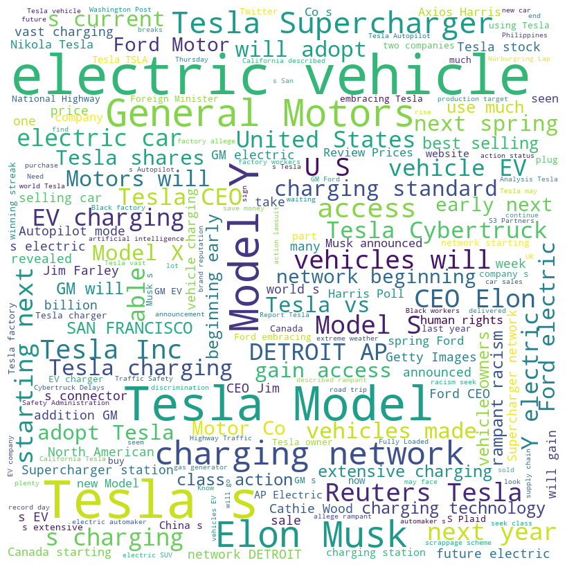
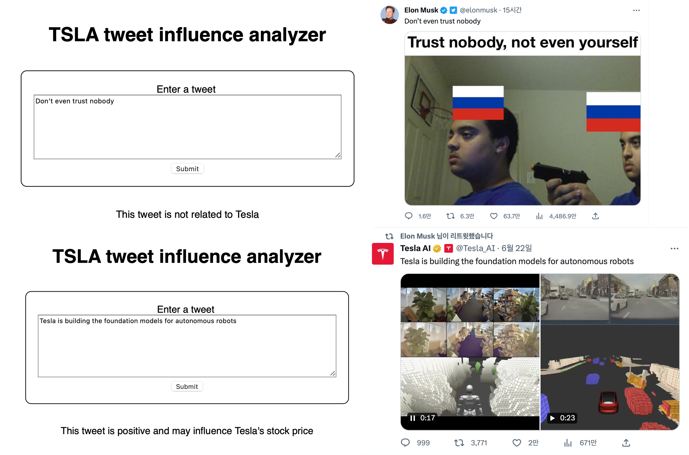
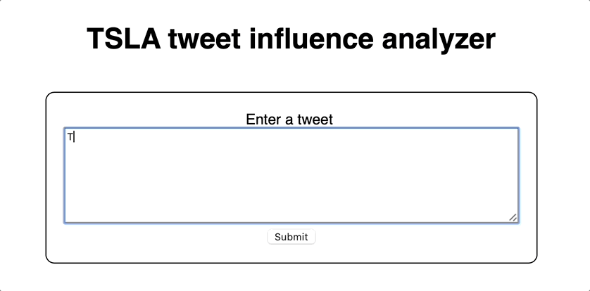

# Watt's Up with Tesla? A Twitter Sentiment Analysis

### HuggingFace Repo
[BLACKBUN/tesla-related-unrelated-classification](https://huggingface.co/BLACKBUN/tesla-related-unrelated-classification)

# Objective

This project aims to classify text related to Tesla and perform sentiment analysis tailored to Tesla stock. Tweets from Elon Musk (CEO of Tesla, Twitter) are often known for their influence on stock prices. With this in mind, we analyze short texts(e.g. tweets) to determine their relevance to Tesla and predict their possible influence on the stock using BERT.


# How to run?

Build environment:

OS: macOS Ventura 13.4.1

Python: 3.10.11

Flask, request, transformers, jsonify

(pip install flask, request, transformers, jsonify)

Run:

1. Clone repository and go to the clonned directory
2. Run this command: “python Flask_API/Flask_API.py”
    
    (This process might take some time at first, so please wait for a while)
    
3. Open “[http://127.0.0.1:5000](http://127.0.0.1:5000/)”
4. Enter text whatever you want. News, tweets … etc

# Methodology

### Data Collection

1. 41,000 Tesla-related News Stories
    1. Used Bing news search API
        
        Keyword: Tesla, Sort by: Relevance, Duration: 21/05/23-20/06/23
        
2. 18,000 latest BBC News Stories
    1. Kaggle BBC News dataset([link](https://www.kaggle.com/datasets/gpreda/bbc-news))
    2. Deleted Tesla-related articles


### Data Preprocessing

1. Data Cleaning
    
    Used Dataframe to select necessary columns(Title, Description) and remove tokens such as HTML tags
    
2. Lowercase Converting
    
    Inputs should be lowercase. Converted all characters to lowercase.
    
3. Domain Specific Word Handling

    Added '_' to domain specific tokens.
    For example, ‘model 3’ → ‘model_3’, ‘model s’ → ‘model_s’
    
4. Imbalanced Data Handling

    Randomly chose 20,000 Tesla-related articles. 
        
    | Label | Count |
    | --- | --- |
    | 0(Not related) | 18639 |
    | 1(Related) | 20000 |
    
    ```cpp
    {"label": 1, "text": "Tesla news description",
    "label": 0, "text": "Other news description", ...}
    ```
    
    Train : Test = 9 : 1 
    

### Models

Used Huggingface API

1. BLACKBUN/tesla-related-unrelated-classification([link](https://huggingface.co/BLACKBUN/tesla-related-unrelated-classification))
    
    Base Model: distilbert-base-uncased(67M)
    
    - Customized tokenizer
        - Added domain-specific tokens like ‘tesla’, ‘model_3’
    - Hyperparameter optimization
    - Binary classification
    
    | model_type | distilbert |
    | --- | --- |
    | activation | gelu |
    | dropout | 0.1 |
    | vocab_size | 30531 |
    | max_position_embeddings | 512 |
    
2. zhayunduo/roberta-base-stocktwits-finetuned([link](https://huggingface.co/zhayunduo/roberta-base-stocktwits-finetuned))
    
    Used pretrained open-source model
    

### Program Description

[](https://mermaid.live/edit#pako:eNplkcuOwiAUhl_lhNVMoi_gYhK1VSdzibGdVeuCwLElUmgo2Gms7z60OBdHFoTz8fFzOxOmOZIZOUjdspIaC2mUK_Btnj2r2vkaP-0eptOnPkHFe1g8bA3WRjNsGhiVx7BgMUiQZCk2ksILdq02HJYlsuM-GMlo9O_awkq7IWx5DrZBiSeqGAb_cuMHNw5sOR5liNihpBZ9SJQNpQklWA1j5v6v_-PGWWI1O4K_ixWV72CuqOwa0Vz9OORjQa04YQ-r7I12UGjgulX_HGcNlT2sh_1LoYqb6a1uRIjYfEe4-mpE48V2cfLxmgayuiPrO7K5IYH9zpMJqdBUVHD_neeB5MSWWGFOZn7I8UCdtDnJ1cWr1FmddIqRmTUOJ8TV3D9QJGhhaBXg5QscA6oI)

This program runs on local Flask server.

1. Relevance classification by searching tesla related tokens (”model_3”, “gigafactory”…)

2. Second relevance classification using fine-tuned BERT.

If the result is "Related", use stock sentiment classification model.

# Findings



EDA of Tesla-related News dataset.

# Results

BLACKBUN/tesla-related-unrelated-classification

- Epochs: 2
- Accuracy: 0.9997



A tweet from Elon Musk

# Limitations

distilbert-base-uncased([link](https://huggingface.co/distilbert-base-uncased)) I added Tesla-related terms to tokenizer, but due to insufficient data(14MB), the newly added tokens(ex “model_3”, “supercharger”) were not embedded well.

I used word2vec, and tf-idf to calculate the relevance score, but it didn't go well.

Therefore, if a Tesla-related term extracted through EDA exists, it is considered relevant, but classification based on context alone performs relatively poorly.

Since we only used news as training data, performance was lower with news as input than with tweets.

I wanted to use Elon Musk's live tweets via API, but Twitter's recent API pricing policy made this impossible.

Dataset consists of data from May-June 2023, so performance may degrade over time.

# Conclusion



Despite the limitation of data collection and computing resources, I managed to train a sentiment classification model for a specific domain. It was less than I originally intended, but it was fun.

# References

BBC News Dataset: [https://www.kaggle.com/datasets/gpreda/bbc-news](https://www.kaggle.com/datasets/gpreda/bbc-news)

distilbert-base-uncased: [https://huggingface.co/distilbert-base-uncased](https://huggingface.co/distilbert-base-uncased)

zhayunduo/roberta-base-stocktwits-finetuned: [https://huggingface.co/zhayunduo/roberta-base-stocktwits-finetuned](https://huggingface.co/zhayunduo/roberta-base-stocktwits-finetuned)
